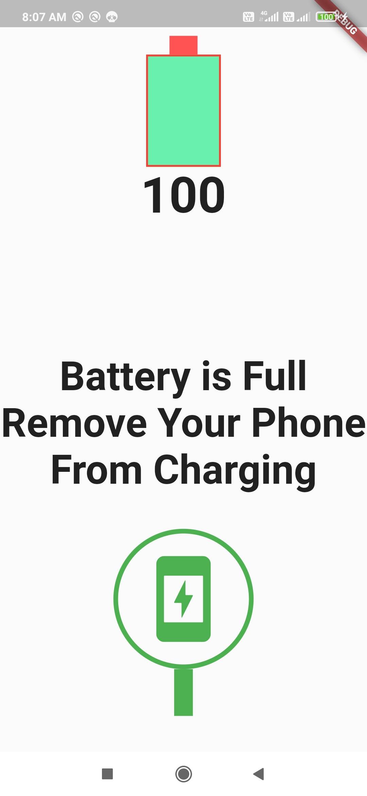

# BtteryAlarm 
## A Application Thats Notify When Battery Is Full During Charging.
```dart 
_batteryStateSubscription = _battery.onBatteryStateChanged.listen((BatteryState state) {
      _batteryState = state;
      print(state);
      setIsCharging();
    });
````
Device Not Connected To Charger And Battery Is Full | Device Connected To Charger And Battery Is Full
----------------------------------------------------|------------------------------------------------
 | 
